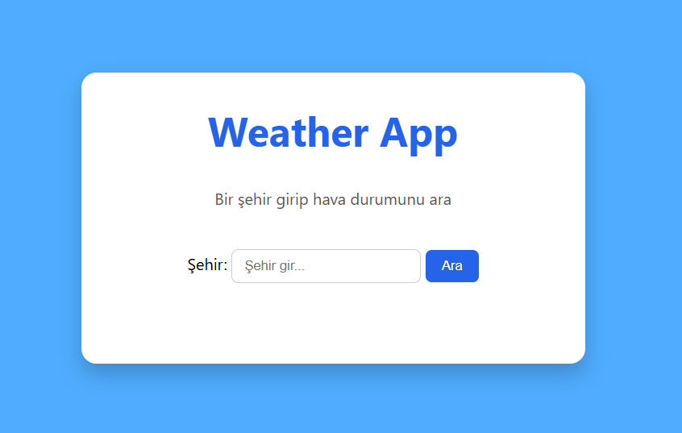

# Weather App

A simple weather application built with HTML, CSS and JavaScript using the Open-Meteo API.

## Live Demo
https://fehmi-gunay.github.io/weather-app/

## Screenshot

## Features
- Search weather by city name
- Shows temperature, feels like, humidity and wind speed
- Displays weather condition based on weather codes
- Error handling for invalid cities

## Technologies
- HTML
- CSS
- JavaScript
- Open-Meteo API
